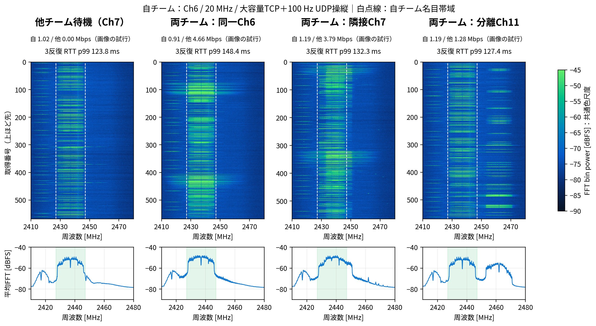

# ロボコンの操縦通信とWi-Fi干渉の可視化

ESP32-C5のスペクトルと、操縦を模したUDP・実ROS 2・ESP-NOWのアプリ応答を比較した室内実験です。指令と大容量通信がAPを中継する構成で、他チームも通信中のチャネル・幅・外部Bluetoothの影響を調べました。

[詳細版PDF](reports/full.pdf) · [X用3ページPDF](reports/twitter.pdf) · [投稿画像](reports/images) · [詳細版LaTeX](reports/full.tex) · [X用LaTeX](reports/twitter.tex)



## 実験から得られたこと

- 自チームの大容量通信中、他チーム負荷によるRTT p99の増分は同一Ch6で約23 ms、隣接Ch7で約9 ms、分離Ch11で約1 msでした。実受信量は条件間で異なり、固定室内配置での比較です。
- 20/40 MHzでは帯域の重なりは広がりましたが、p99は単調に悪化しませんでした。帯域幅と平均Mbpsだけでは操縦品質を決められません。
- 実ROS 2は指令側Humble・ロボット側Jazzy、双方CycloneDDSです。合成Image／PointCloud2を追加すると20 ms期限超過は約45%から約70〜80%へ増えました。センサQoSの深さ1や省電力OFFだけで今回の遅延は解消しませんでした。
- 流量制限・生成周期の変更も比較しました。要求量、送信側受付、実受信、期限超過を分け、未送信データの蓄積を「通信速度を達成」と取り違えないようにします。
- ESP-NOW長時間試験は各600秒、19試行、8条件を2〜3反復です。960,000指令のうちunique応答は959,997件でした。100 Hz負荷中のp99は9.26 ms、200 Hzでは14.26 msで、短い区間に期限超過が集中しました。異なる端末・経路・実装のUDP／ROS 2との方式だけの勝敗は決められません。
- 独立BLEの広告・GATT通知は復号・実受信も確認しました。Wi-Fi p99が近い条件でも、期限超過と双方の配送量は異なりました。広告と接続後のホッピングを分け、今回測っていないAFHの効果だけへ帰属しないように説明しています。

- ESP32間で基準前、90°回転、手による遮蔽、75→150 cm、基準復帰を各10秒で比較しました。全30試行・30,000指令で応答欠落はありませんでした。元の配置へ戻した後もp99が低下したため、回転や手だけの改善効果とは断定できません。最新パケットのRSSIと共通尺度の青緑画像も保存しています。

| 系列 | 試行数 | 予定・要求指令 | unique応答 | I/Q取得 |
| --- | ---: | ---: | ---: | ---: |
| 先行操縦通信 | 56 | 168,000 | 167,996 | 34,320 |
| 両チーム・周期Wi-Fi・BLE | 69 | 207,000 | 189,858 | 39,149 |
| 先行ESP-NOW | 18 | 54,000 | 53,928 | 10,210 |
| 流量制限 | 45 | 135,000 | 122,665 | 25,518 |
| 生成周期 | 36 | 108,000 | 93,361 | 20,422 |
| 実ROS 2 QoS | 45 | 135,000 | 115,184 | 25,569 |
| 省電力ON／OFF | 24 | 72,000 | 63,334 | 13,650 |
| ESP-NOW長時間 | 19 | 960,000 | 959,997 | 215,489 |
| 短時間配置比較 | 30 | 30,000 | 30,000 | 5,641 |

先行計342通信試行と、構成を区別した115受信観測系列を統合しました。長時間試験は使用者の終了希望で残り5試行を省略し、24試行完了とは扱いません。保存待ち超過の別600秒記録は補足として保持し、正式19試行へ混ぜません。実センサやモータの安全停止は測定していません。

青〜緑は未校正のFFT電力（dBFS）。各行は約205 µsの間欠取得で、占有率や通信成功率ではありません。

[統合した結果と考察](docs/operational-results.md) · [流量・生成周期](docs/operational-method.md) · [ROS 2](docs/ros2-method.md) · [長時間ESP-NOW](docs/espnow-long-method.md) · [配置比較](docs/placement-method.md)

<!-- MUTUAL OVERVIEW BEGIN -->
## 双方向共存評価の追加

ESP-NOW42試行とBLE18試行（各20秒・3反復）、同じTCP接続の停止前／動作／停止後9ブロックを追加しました。先行の2ホップ系列と異なる1ホップ系列です。

- 同一Ch6・200 HzではWi-Fi実受信平均が0.411→1.107 Mbpsへ増えましたが、Wi-Fi指令の20 ms超過も0.05→2.73%へ増えました。Mbpsと操縦品質は別に判断します。
- BLE通知はWi-Fi TCPなし／負荷で0.497／0.494 Mbpsでした。一方、Wi-Fi指令の20 ms超過はBLE停止／通知で0.067／0.483%でした。
- 速度低下率は停止対照と反復ごとに比較し、負の値と範囲も表示します。TCP・端末処理・外来通信をRFの影響だけへ帰属しません。

[追加結果と考察](docs/coexistence-results.md) · [双方向評価の方法](docs/coexistence-method.md)
<!-- MUTUAL OVERVIEW END -->

## ショート動画

ESP32-C5の実測SDR画像と8本のManim図解を、54.8秒の縦動画にまとめました。図解・測定画像を画面いっぱいに配置し、ずんだもんの1.5倍速音声を合成しています。チャンネルの重なり、追加遅延、帯域幅、BLE／ESP-NOW、間欠取得の読み方を説明します。

[制作ソース・再生成手順](video/README.md) · [X／YouTube用投稿文](video/post-texts.md)

## ディレクトリ

| 場所 | 内容 |
| --- | --- |
| `reports/` | 詳細版とX用の2種類のLaTeX、PDF、投稿画像 |
| `experiments/data/` | 匿名化した解析統計・FFT電力・操縦UDP相対時刻 |
| `experiments/figures/` | 基礎観測・受信評価・操縦通信・概要の図 |
| `experiments/scripts/` | 図の生成、結果検算、実機取得コード |
| `experiments/firmware/` | ESP32の通信負荷・コントローラー・BLEファームウェア |
| `docs/` | 実験条件・データ形式・再生成方法 |
| `video/` | Remotion・Manim・VOICEVOXによるショート動画の制作ソースと入力素材 |
| `main/`, `components/` | 上流ESP-SDRとC5用の変更 |

実験は日付別に分けず、役割別に整理しました。`baseline`は基礎観測、`receiver`は受信系の補足評価、`robotics`は先行操縦通信、`two-team`は両チーム負荷・周期Wi-Fi・BLE比較、`espnow`は先行ESP-NOW指令と外部Wi-Fi比較、`operational`は流量・周期・ROS 2・省電力・長時間・配置比較です。

## 再生成

LuaLaTeX、luatexja、Harano Ajiフォント、Poppler、Pythonが必要です。

```sh
python3 -m venv .venv
. .venv/bin/activate
pip install -r requirements.txt
make check        # 公開データのハッシュと遅延統計を検算
make figures      # 実測FFT電力から青・緑の図を再生成
make reports      # full.tex と twitter.tex をコンパイル
make images       # X用PDFを300 dpi PNGへ変換
```

図の日本語表示にはNoto Sans CJK JPを使用します。既存のPDF・PNGはそのまま閲覧できます。公開データから再現できる範囲と実機実験の準備は[再生成方法](docs/reproduction.md)を参照してください。

## 上流とライセンス

[ESPARGOS/esp-sdr](https://github.com/ESPARGOS/esp-sdr)を基にしています。上流の履歴、GPL-3.0の[LICENSE](LICENSE)、ファームウェア文書を保持しています。[上流README](docs/upstream.md)に元のプロジェクト説明があります。測定値を引用する際は、試行数・条件・間欠観測の制約も併記してください。
