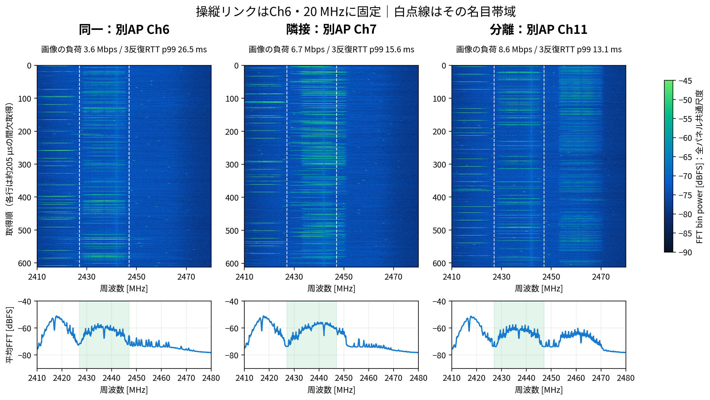

# ロボコンの操縦通信とWi-Fi干渉の可視化

貝淵蒼馬

ESP32-C5で受信したスペクトルと、操縦を模した100 Hz UDP通信の遅延を対応づけた室内実験です。チャンネルの重なり、20/40 MHzの幅、同じAPでの映像相当負荷が、操縦の応答にどう現れるかを調べました。

[詳細版PDF](reports/full.pdf) · [X用3ページPDF](reports/twitter.pdf) · [投稿画像](reports/images) · [詳細版LaTeX](reports/full.tex) · [X用LaTeX](reports/twitter.tex)



## 実験から得られたこと

- 同じAPの通信負荷を増やすと、欠落がなくても操縦UDPの遅延が増えました。待機時のRTT p99は10.56 ms、実効38–41 MbpsのTCP負荷時は36.93 ms、20 ms期限超過は7.42%でした。
- 別APを同一・隣接・分離チャンネルへ変えたTCP実験のRTT p99は、それぞれ26.46・15.60・13.10 msでした。受信画像では、操縦リンクの帯域と負荷信号の重なりを比較できます。
- 別APのCh1を20 MHzから40 MHzへ広げると、操縦リンクCh6との重なりが増えました。UDP要求20 Mbpsの条件では40 MHz時の期限超過が40.59%でしたが、反復間の変動も大きく、普遍的な改善・悪化量ではありません。
- TCPとUDPで結果の順序が変わりました。要求速度と実効速度を分け、スペクトルと遅延の両方で判断する必要があります。

56試行・19条件群・168,000回の操縦送信と34,320回のI/Q取得を行いました。先行する115系列・27,540回のI/Q取得も詳細版に統合しています。距離や向きを振った実験ではなく、同じ室内配置での比較です。実際の競技場や移動するロボットでの性能保証には使えません。

画像の色は相対FFT電力（dBFS）です。各行は約205 µsの間欠取得で、連続した受信時間やチャンネル占有率を表しません。詳しい考察と限界はPDFに記載しています。

## ディレクトリ

| 場所 | 内容 |
| --- | --- |
| `reports/` | 詳細版とX用の2種類のLaTeX、PDF、投稿画像 |
| `experiments/data/` | 匿名化した解析統計・FFT電力・操縦UDP相対時刻 |
| `experiments/figures/` | 基礎観測・受信評価・操縦通信・概要の図 |
| `experiments/scripts/` | 図の生成、結果検算、実機取得コード |
| `experiments/firmware/robotics/` | 追加ESP32の通信実験ファームウェア |
| `docs/` | 実験条件・データ形式・再生成方法 |
| `main/`, `components/` | 上流ESP-SDRとC5用の変更 |

実験は日付別に分けず、役割別に整理しました。`baseline`は基礎観測、`receiver`は受信系の補足評価、`robotics`は操縦通信の比較です。

## 再生成

LuaLaTeX、luatexja、Harano Ajiフォント、Poppler、Pythonが必要です。

```sh
python3 -m venv .venv
. .venv/bin/activate
pip install -r requirements.txt
make check        # 公開データのハッシュと遅延統計を検算
make figures      # 実測FFT電力から青・緑の図を再生成
make reports      # full.tex と twitter.tex をコンパイル
make images       # X用PDFを300 dpi PNGへ変換
```

図の日本語表示にはNoto Sans CJK JPを使用します。既存のPDF・PNGはそのまま閲覧できます。公開データから再現できる範囲と実機実験の準備は[再生成方法](docs/reproduction.md)を参照してください。

## 上流とライセンス

[ESPARGOS/esp-sdr](https://github.com/ESPARGOS/esp-sdr)を基にしています。上流の履歴、GPL-3.0の[LICENSE](LICENSE)、ファームウェア文書を保持しています。[上流README](docs/upstream.md)に元のプロジェクト説明があります。測定値を引用する際は、試行数・条件・間欠観測の制約も併記してください。
